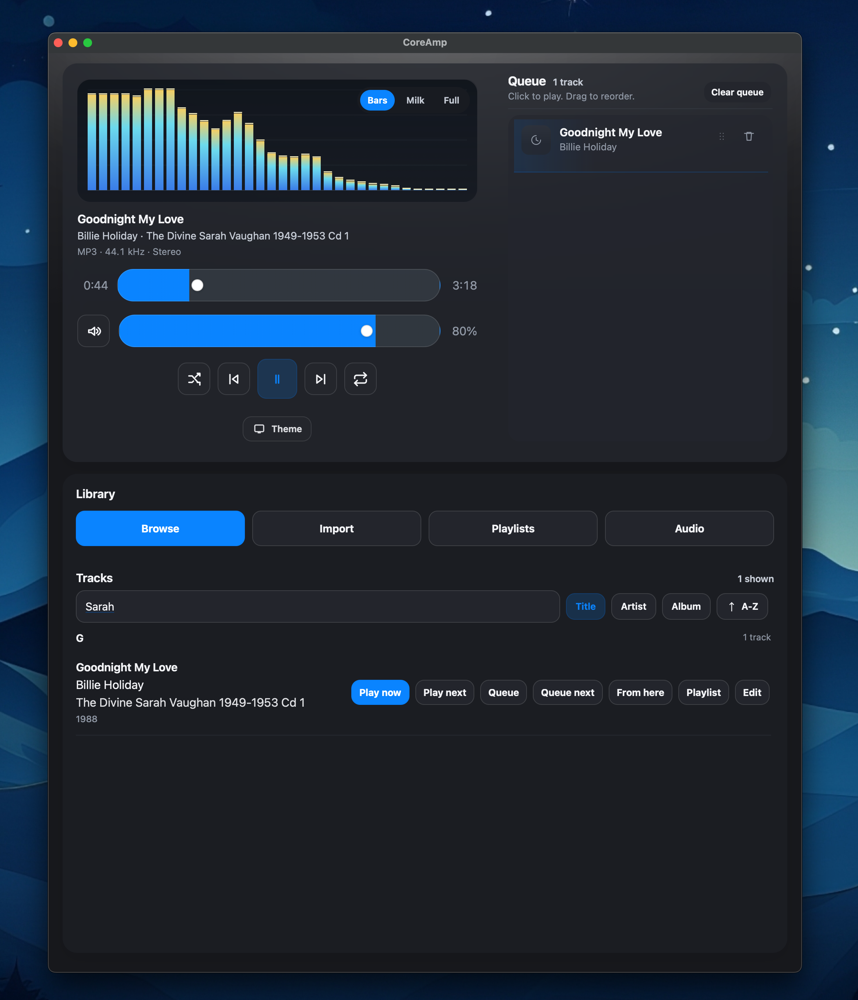
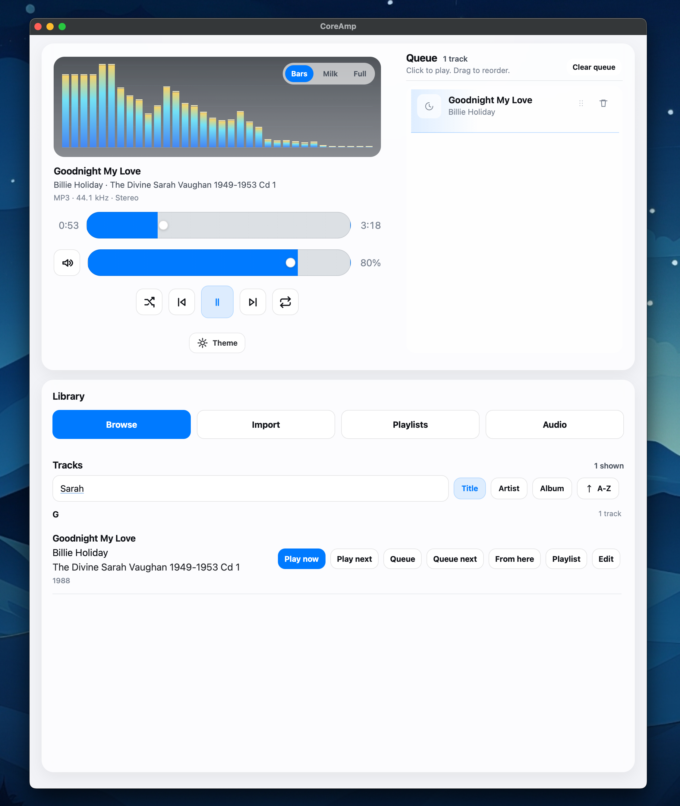

# CoreAmp

**Lightweight, Privacy-First Media Player for Modern Desktops.**

CoreAmp is a "Zero-Config" audio player built for macOS and Linux. It adheres to the **KISS (Keep It Simple, Stupid)** philosophy: a minimalist interface, robust performance, and total local ownership of your data.




[](https://github.com/velkymx/CoreAmp/actions/workflows/ci.yml)
[](LICENSE)

---

## 🚀 Features

- **Minimalist UI:** Designed to stay out of your way. A sleek, "post-glass" aesthetic that feels native to modern macOS and Linux (Wayland/X11).
- **Privacy First:** Zero telemetry. No cloud accounts. No tracking. All your music data stays on your machine.
- **Background Metadata Enrichment:** A silent daemon automatically fills in missing tags (artist, album, year) using MusicBrainz and acoustic fingerprinting.
- **Audiophile Grade:**
  - **Parametric EQ:** 5-band EQ with frequency, gain, and Q control.
  - **DSP Chain:** Built-in Limiter, Preamp, and Bass Boost (Off, +, ++).
  - **Gapless Playback:** Seamless transitions for live albums and classical works.
  - **Direct Output:** Explicitly select your DACs, headphones, or speakers.
- **Smart Library:** Automatically indexes your music folders and supports drag-and-drop for MP3, FLAC, and OGG files.
- **Playlist Management:** Classic M3U support with drag-and-drop reordering and shuffle.

## 🛠 Technical Architecture

CoreAmp follows the "Unix Way" by separating the interface from the heavy lifting:

- **CoreAmp (The App):** A [Tauri v2](https://tauri.app/) application (Rust + HTML/CSS/JS) for playback control and UI.
- **CoreAmp-Daemon:** A background service that handles file system scanning and metadata enrichment.
- **Shared Core:** A shared Rust library (`coreamp-common`) for database (SQLite) and IPC logic.

| Component | Technology |
| :--- | :--- |
| **Language** | Rust |
| **UI** | Tauri v2 (React + Vanilla CSS) |
| **Audio** | CPAL (Pure Rust) |
| **Metadata** | Lofty |
| **Database** | SQLite (via Rusqlite) |

## 📦 Installation

### Prerequisites (Linux)
You will need the following system libraries:
- `libwebkit2gtk-4.1`
- `libasound2` (ALSA)
- `libgtk-3`

### Build from Source
```bash
git clone https://github.com/velkymx/CoreAmp.git
cd CoreAmp
cargo build --release
```
The binaries will be located in `target/release/`.

## 🤝 Contributing & Dependencies

CoreAmp is built on the shoulders of giants. See [CONTRIBUTORS.md](CONTRIBUTORS.md) for a full list of the open-source libraries we use.

## ⚖️ License

CoreAmp is licensed under the **Polyform Non-Commercial License 1.0.0**. 

- **Personal/Non-Commercial Use:** Free to use, modify, and distribute for personal, educational, or research purposes.
- **Commercial Use:** Requires explicit permission from the author.

See the [LICENSE](LICENSE) file for the full text.

---

*CoreAmp: Simply play your music.*
