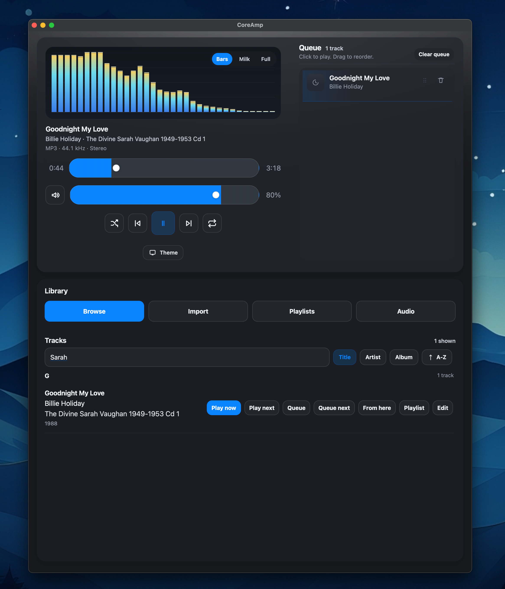
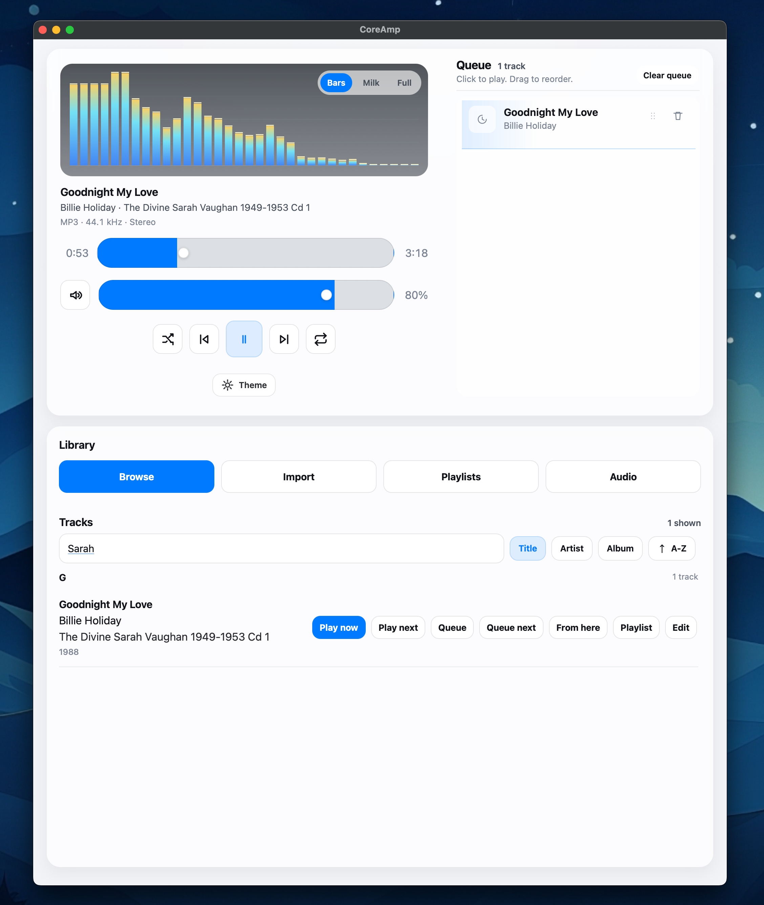

# CoreAmp

**A clean, consistent, privacy-first music player for modern desktops.**

CoreAmp is a zero-config audio player for macOS and Linux. The interface is built on a single modern component system, so every screen, from the player to the library to settings, shares one consistent visual language. Your music and your data stay entirely on your machine.




[](https://github.com/velkymx/CoreAmp/actions/workflows/ci.yml)
[](LICENSE)

---

## The interface

The front end is a Vue 3 application built entirely on [VibeUI](https://github.com/velkymx/vibeui), a consistent component library that gives CoreAmp one cohesive look from edge to edge.

- **One design system.** Every control, table, button, and panel is a VibeUI component, so spacing, color, and behavior stay consistent throughout the app.
- **Player-first layout.** The now-playing panel and queue sit up top with a fixed, predictable footprint. The library never gets pushed around, and each pane scrolls its own content.
- **A real library view.** Sortable, searchable, paginated track tables with segmented Tracks, Artists, Albums, and Genres views, album-art grids, and inline actions (play next, add to queue, edit metadata, jump to artist or album).
- **Light and dark themes** with an in-app toggle, a slim global loading indicator, and clear, dismissible error reporting.

## Features

- **Privacy first.** Zero telemetry. No cloud accounts. No tracking. Everything stays local.
- **Audio engine.** 10-band graphic EQ with savable presets, ReplayGain (track and album), crossfade, and gapless playback.
- **Playback.** Smart shuffle, repeat modes (off, queue, track), volume with mute, working scrub and seek, and a sleep timer.
- **Library.** Automatic indexing of your music folders, drag-and-drop import, fast browsing, and paginated track lists for large collections.
- **Metadata.** 0 to 5 star ratings, full tag editing, manual album-artwork replacement, and background enrichment via MusicBrainz and the Cover Art Archive.
- **System integration.** Media keys and macOS Now Playing, a live tray now-playing label, and a built-in updater.
- **Visualizer.** Several reactive modes, plus two optional games tucked into the visualizer (Keyboard Hero and Chicken Lander).

## Technical architecture

CoreAmp separates the interface from the heavy lifting:

- **CoreAmp (the app):** A [Tauri v2](https://tauri.app/) application with a Vue 3 and VibeUI front end for playback control and UI.
- **CoreAmp-Daemon:** A background service that handles file-system scanning and metadata enrichment.
- **Shared core:** A Rust library (`coreamp-common`) for the SQLite database and IPC logic.

| Component | Technology |
| :--- | :--- |
| **Language** | Rust |
| **Front end** | Tauri v2, Vue 3, Pinia, [VibeUI](https://github.com/velkymx/vibeui) |
| **Audio** | Web Audio graph (EQ, ReplayGain, crossfade, gapless) |
| **Metadata** | Lofty |
| **Database** | SQLite (via Rusqlite) |

## Installation

### Prerequisites (Linux)

You will need the following system libraries:

- `libwebkit2gtk-4.1`
- `libasound2` (ALSA)
- `libgtk-3`

### Build from source

```bash
git clone https://github.com/velkymx/CoreAmp.git
cd CoreAmp
cargo build --release
```

The binaries will be located in `target/release/`.

## Contributing and dependencies

CoreAmp is built on the shoulders of giants. See [CONTRIBUTORS.md](CONTRIBUTORS.md) for a full list of the open-source libraries we use, and [CONTRIBUTING.md](CONTRIBUTING.md) for how to get involved.

## License

CoreAmp is licensed under the **Polyform Non-Commercial License 1.0.0**.

- **Personal and non-commercial use:** Free to use, modify, and distribute for personal, educational, or research purposes.
- **Commercial use:** Requires explicit permission from the author.

See the [LICENSE](LICENSE) file for the full text.

---

*CoreAmp: simply play your music.*
